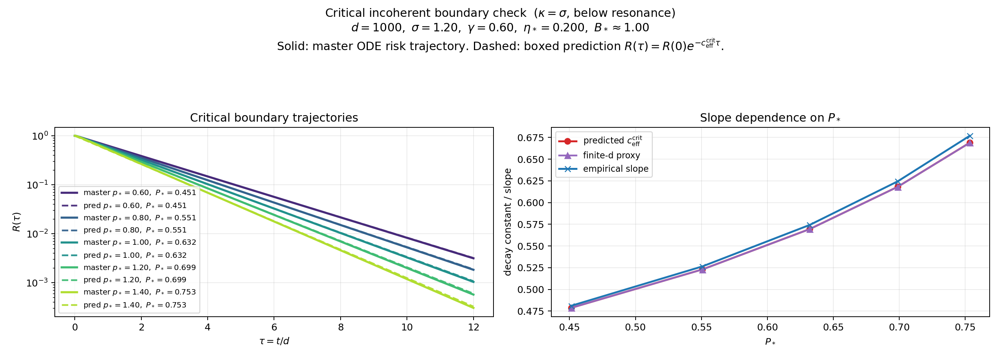
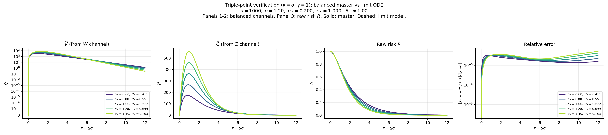
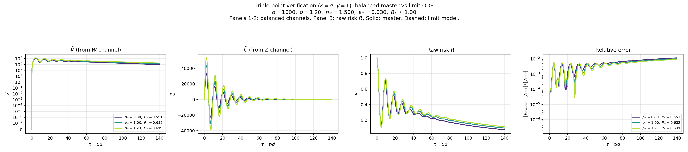

# sparseheavyball

Lightweight simulation workspace for sparse-momentum ODE scaling studies.

## What Is Here

- `simulations/master_ode.py`  
  Core master ODE model and linear ODE integrators.

- `simulations/run_region_panel.py`  
  Baseline panel over representative interior points of the scaling regions.

- `simulations/run_rescaled_limit_panel.py`  
  Regime-rescaled master ODE trajectories overlaid with simplified limit ODEs.

- `simulations/run_coherent_finite_size_sweep.py`  
  Coherent-regime finite-size sweep across multiple `d`.

- `simulations/run_last_iter_risk_heatmap.py`  
  Grid search over \((\kappa,\gamma)\), with per-point LR optimization and risk heatmaps.

- `simulations/export_last_iter_split_heatmaps.py`  
  Exports standalone optimal-LR and last-iterate-risk heatmaps from a CSV grid.

- `simulations/run_critical_incoherent_boundary_verification.py`  
  Verification script for the critical incoherent boundary regime (\(\kappa=\sigma,\ 0<\gamma<1\)).

- `simulations/run_triple_point_verification.py`  
  Verification script for the triple-point 3D regime (\(\kappa=\sigma,\ \gamma=1\)).

- `logistic/`  
  Five-variable ODE for logistic regression on a rare-event classification problem.
  Validation scripts and hyperparameter sweeps. See `logistic/README.md`.

## Quick Start

```bash
source /opt/e-py/bin/activate
```

Generate a sample heatmap (active-iterates timescale):

```bash
MPLBACKEND=Agg MPLCONFIGDIR=/tmp/mpl python simulations/run_last_iter_risk_heatmap.py \
  --d 2000 \
  --sigma 1.2 \
  --time 100 \
  --time-rule active-iterates \
  --search-factor 1.1 \
  --binary-search-steps 6 \
  --max-dyadic-steps 20 \
  --grid-fineness 31 \
  --num-workers 8 \
  --figure-title "README sample: Active-Iterates" \
  --out-heatmaps simulations/outputs/readme_sample_heatmap.png \
  --out-eta-scaled simulations/outputs/readme_sample_eta_scaled.png \
  --out-csv simulations/outputs/readme_sample_grid.csv
```

Generate a sample efficiency heatmap (sample-timescale):

```bash
MPLBACKEND=Agg MPLCONFIGDIR=/tmp/mpl python simulations/run_last_iter_risk_heatmap.py \
  --d 2000 \
  --sigma 1.2 \
  --time 24 \
  --time-rule sample \
  --search-factor 1.1 \
  --binary-search-steps 6 \
  --max-dyadic-steps 20 \
  --grid-fineness 31 \
  --num-workers 8 \
  --figure-title "README sample: Sample Efficiency" \
  --out-heatmaps simulations/outputs/readme_sample_efficiency_heatmap.png \
  --out-eta-scaled /tmp/readme_sample_efficiency_eta_scaled.png \
  --out-csv /tmp/readme_sample_efficiency_grid.csv
```

Critical incoherent-boundary verification MWE:

```bash
MPLBACKEND=Agg MPLCONFIGDIR=/tmp/mpl python simulations/run_critical_incoherent_boundary_verification.py \
  --d 1000 \
  --sigma 1.2 \
  --gamma 0.6 \
  --eta-star 0.2 \
  --B-star 1.0 \
  --p-star-list 0.6 0.8 1.0 1.2 1.4 \
  --tau-max 12 \
  --out-png simulations/outputs/critical_incoherent_boundary_verification.png \
  --out-csv /tmp/critical_incoherent_boundary_verification_metrics.csv
```

Triple-point verification MWE (physical raw init \([R,V,C]=[1,0,0]\)):

```bash
MPLBACKEND=Agg MPLCONFIGDIR=/tmp/mpl python simulations/run_triple_point_verification.py \
  --d 1000 \
  --sigma 1.2 \
  --eta-star 0.2 \
  --eps-star 1.0 \
  --B-star 1.0 \
  --init-mode raw \
  --raw-init 1.0 0.0 0.0 \
  --p-star-list 0.6 0.8 1.0 1.2 1.4 \
  --tau-max 12 \
  --out-png simulations/outputs/triple_point_verification.png \
  --out-csv /tmp/triple_point_verification_metrics.csv
```

Triple-point resonant MWE (near-critical oscillatory behavior):

```bash
MPLBACKEND=Agg MPLCONFIGDIR=/tmp/mpl python simulations/run_triple_point_verification.py \
  --d 1000 \
  --sigma 1.2 \
  --eta-star 1.5 \
  --eps-star 0.03 \
  --B-star 1.0 \
  --init-mode raw \
  --raw-init 1.0 0.0 0.0 \
  --p-star-list 0.8 1.0 1.2 \
  --tau-max 140 \
  --steps-per-tau 600 \
  --out-png simulations/outputs/triple_point_verification_resonant.png \
  --out-csv /tmp/triple_point_verification_resonant_metrics.csv
```

## Sample Output

`simulations/outputs/readme_sample_heatmap.png`


`simulations/outputs/readme_sample_efficiency_heatmap.png`


`simulations/outputs/critical_incoherent_boundary_verification.png`



`simulations/outputs/triple_point_verification.png`



`simulations/outputs/triple_point_verification_resonant.png`


